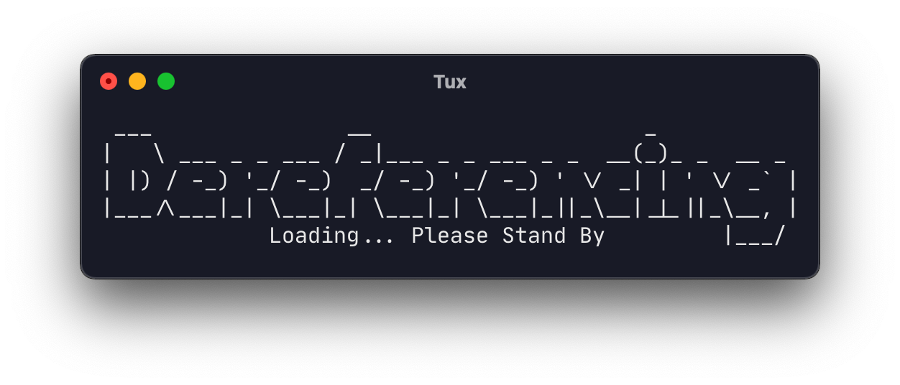
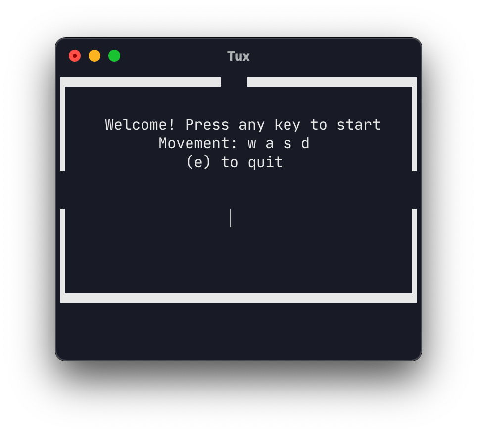
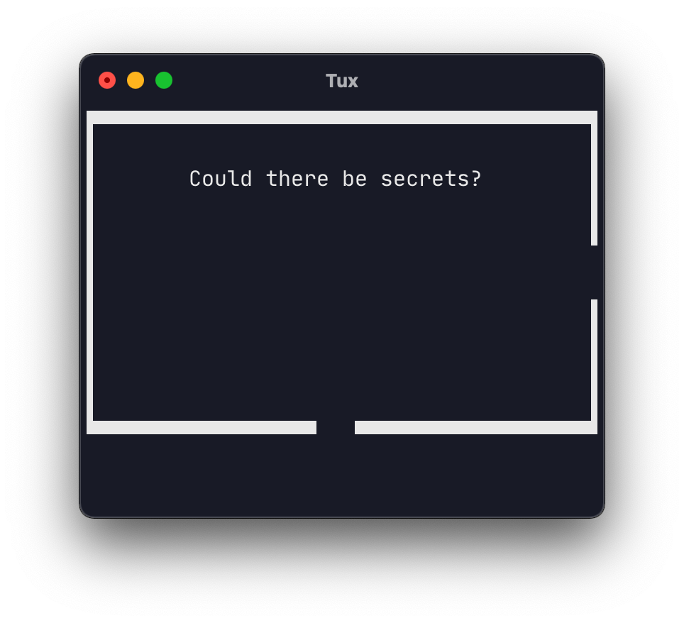

# Adventure
Small retro-like adventure game written in C

# How to play:
- Download the pre-compiled binary "adventure" or compile the game from source
- The pre-compiled binary must be made executable with chmod
- Free the princess and find the easter egg

# Movement:
- w,a,s,d : Move left, up, down, right
- e : Quit the game

# How to compile:

Compile the source code with gcc:
```bash
gcc -o adventure adventure.c
```

Making the pre-compiled binary exectuble:
```
chmod +x adventure
```

Run the compiled binary
```
./adventure
```

# Pictures




